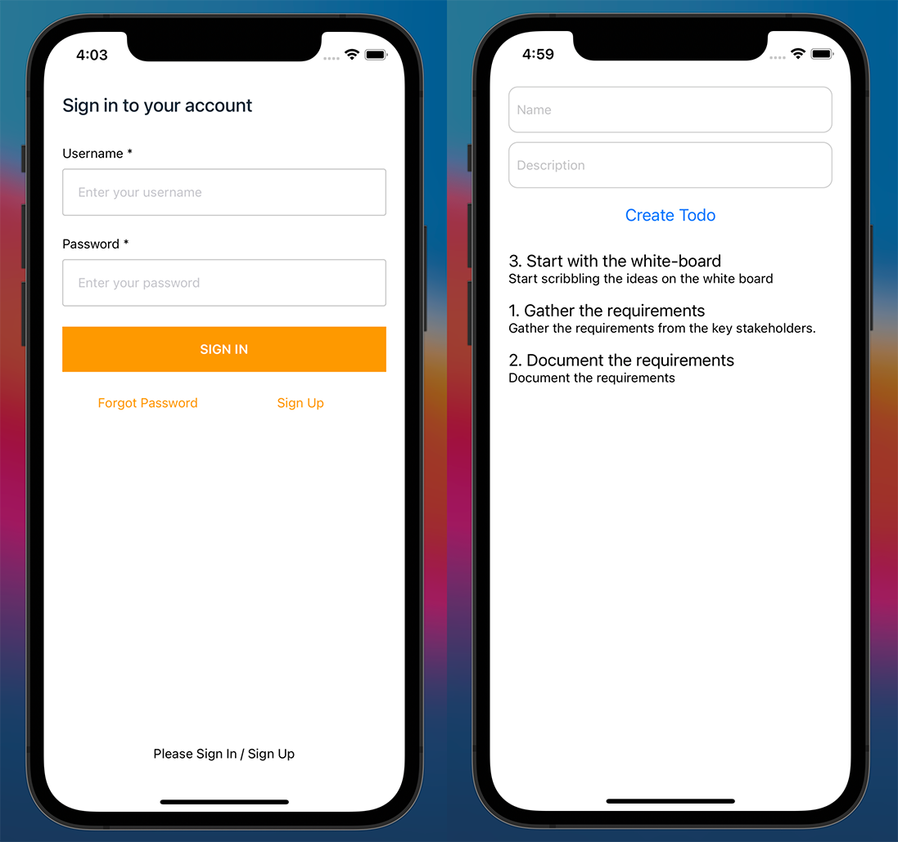
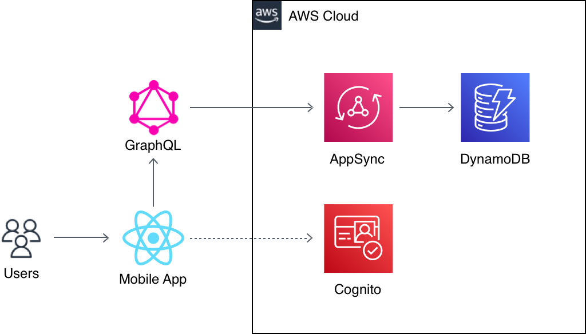

# Build a Serverless Mobile (React Native (iOS)) App using AWS Amplify

The below provided steps and sample code provides an example of creating a To Do React Native (Mobile - iOS) App using AWS Amplify and React Native.



# Create and start the ToDoList React Native app

```sh
react-native init ToDoListAmplify
cd ToDoListAmplify
npx react-native run-ios

```

# Initialise the backend

Initialise the backend and configure the project.

```sh
amplify init
```

# Add the authentication

The Amplify Framework uses Amazon Cognito as the main authentication provider. Amazon Cognito is a robust user directory service that handles user registration, authentication, account recovery & other operations. In this tutorial, you'll learn how to add authentication to your application using Amazon Cognito and username/password login.

This command creates the necessary folders, files and dependency files in local folder under the amplify folder. aws-exports.js file is created/updated with pool details.

```sh
amplify add auth
```

# Deploy the Amazon Cognito service to AWS Cloud

```sh
amplify push
```

# Install the Amplify libraries

```sh
npm install aws-amplify aws-amplify-react-native amazon-cognito-identity-js @react-native-community/netinfo @react-native-async-storage/async-storage
```

# Install the pod dependencies for iOS

```sh
npx pod-install
```

# Connect API and database to the app

Add a GraphQL API to your app and automatically provision a database by running the following command from the root of your application directory. Refer the Configuration for details.

```sh
amplify add api
```

The schema generated for the Todo app must be as provided below:

```sh
type Todo @model {
   id: ID!
   name: String!
   description: String
}
```

# Deploy the API

```sh
amplify push
```

# Connect frontend to API

The App.js file contains all the required code to:

- Show the form for creating a ToDo Item with title and description fields
- Displays the list of ToDos items (title and description)
- Post and fetch the data using 'aws-amplify' methods

# Architecture Diagram



## Security

See [CONTRIBUTING](CONTRIBUTING.md#security-issue-notifications) for more information.

## License

This library is licensed under the MIT-0 License. See the LICENSE file.
